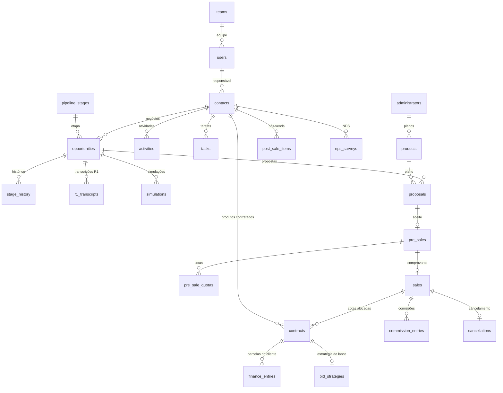
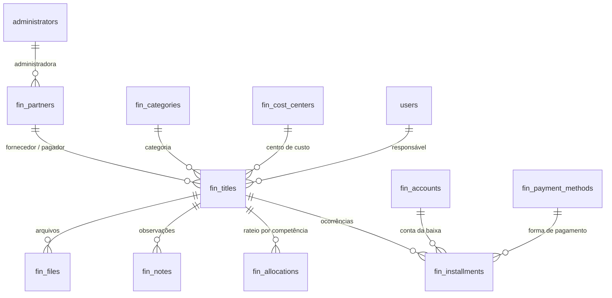

# Modelo de dados

Gerado por `scripts/ddl.js` (rode `node scripts/ddl.js` depois de mudar o esquema). O DDL completo está em [`DDL.sql`](DDL.sql).

**62 tabelas**, **174 chaves estrangeiras** declaradas e **17 relacionamentos lógicos** (sem FOREIGN KEY no banco, garantidos pela aplicação).

## Visão geral do fluxo comercial

## Visão geral do financeiro da empresa

## Chaves estrangeiras por tabela

### Acesso, configuração e auditoria

| Tabela | Coluna | Referência | Regra |
|---|---|---|---|
| `users` | `team_id` | `teams(id)` | — |
| `teams` | `leader_id` | `users(id)` | — |
| `sessions` | `user_id` | `users(id)` | — |
| `settings` | — | — | sem chave estrangeira |
| `options` | — | — | sem chave estrangeira |
| `counters` | — | — | sem chave estrangeira |
| `custom_fields` | — | — | sem chave estrangeira |
| `notifications` | `user_id` | `users(id)` | — |
| `audit_log` | `user_id` | `users(id)` | — |

### Cadastros (prospects, leads e clientes)

| Tabela | Coluna | Referência | Regra |
|---|---|---|---|
| `contacts` | `owner_id` | `users(id)` | — |
| `contacts` | `created_by` | `users(id)` | — |
| `contacts` | `updated_by` | `users(id)` | — |
| `contacts` | `merged_into_id` | `contacts(id)` | — |
| `contacts` | `referred_by_id` | `contacts(id)` | — |
| `contacts` | `assigned_by` | `users(id)` | — |
| `contacts` | `postsale_owner_id` | `users(id)` | — |
| `addresses` | `contact_id` | `contacts(id)` | — |
| `addresses` | `created_by` | `users(id)` | — |
| `company_contacts` | `company_id` | `contacts(id)` | — |
| `company_contacts` | `created_by` | `users(id)` | — |
| `partners` | `contact_id` | `contacts(id)` | — |
| `partners` | `created_by` | `users(id)` | — |
| `contact_origins` | `contact_id` | `contacts(id)` | — |
| `contact_origins` | `created_by` | `users(id)` | — |
| `consents` | `contact_id` | `contacts(id)` | — |
| `consents` | `company_contact_id` | `company_contacts(id)` | — |
| `consents` | `recorded_by` | `users(id)` | — |
| `data_requests` | `contact_id` | `contacts(id)` | — |
| `data_requests` | `created_by` | `users(id)` | — |
| `data_requests` | `resolved_by` | `users(id)` | — |
| `client_links` | `contact_id` | `contacts(id)` | — |
| `client_links` | `created_by` | `users(id)` | — |
| `attachments` | `contact_id` | `contacts(id)` | — |
| `attachments` | `proposal_id` | `proposals(id)` | — |
| `attachments` | `contract_id` | `contracts(id)` | — |
| `attachments` | `uploaded_by` | `users(id)` | — |
| `attachments` | `reviewed_by` | `users(id)` | — |
| `attachment_opportunities` | `attachment_id` | `attachments(id)` | — |
| `attachment_opportunities` | `opportunity_id` | `opportunities(id)` | — |
| `imports` | `created_by` | `users(id)` | — |

### Funil, atividades e distribuição

| Tabela | Coluna | Referência | Regra |
|---|---|---|---|
| `pipeline_stages` | — | — | sem chave estrangeira |
| `opportunities` | `contact_id` | `contacts(id)` | — |
| `opportunities` | `company_contact_id` | `company_contacts(id)` | — |
| `opportunities` | `product_id` | `products(id)` | — |
| `opportunities` | `stage_id` | `pipeline_stages(id)` | — |
| `opportunities` | `strategy_validated_by` | `users(id)` | — |
| `opportunities` | `owner_id` | `users(id)` | — |
| `opportunities` | `created_by` | `users(id)` | — |
| `opportunities` | `updated_by` | `users(id)` | — |
| `stage_history` | `opportunity_id` | `opportunities(id)` | — |
| `stage_history` | `from_stage_id` | `pipeline_stages(id)` | — |
| `stage_history` | `to_stage_id` | `pipeline_stages(id)` | — |
| `stage_history` | `user_id` | `users(id)` | — |
| `r1_transcripts` | `opportunity_id` | `opportunities(id)` | — |
| `r1_transcripts` | `created_by` | `users(id)` | — |
| `activities` | `contact_id` | `contacts(id)` | — |
| `activities` | `company_contact_id` | `company_contacts(id)` | — |
| `activities` | `opportunity_id` | `opportunities(id)` | — |
| `activities` | `user_id` | `users(id)` | — |
| `activities` | `created_by` | `users(id)` | — |
| `tasks` | `contact_id` | `contacts(id)` | — |
| `tasks` | `opportunity_id` | `opportunities(id)` | — |
| `tasks` | `assigned_to` | `users(id)` | — |
| `tasks` | `created_by` | `users(id)` | — |
| `tasks` | `completed_by` | `users(id)` | — |
| `tasks` | `proposal_id` | `proposals(id)` | — |
| `distribution_log` | `contact_id` | `contacts(id)` | — |
| `distribution_log` | `from_user` | `users(id)` | — |
| `distribution_log` | `to_user` | `users(id)` | — |
| `distribution_log` | `by_user` | `users(id)` | — |
| `goals` | `user_id` | `users(id)` | — |
| `goals` | `team_id` | `teams(id)` | — |
| `goals` | `created_by` | `users(id)` | — |

### Catálogo: administradoras e planos

| Tabela | Coluna | Referência | Regra |
|---|---|---|---|
| `administrators` | — | — | sem chave estrangeira |
| `products` | `administrator_id` | `administrators(id)` | — |

### Simulações e propostas

| Tabela | Coluna | Referência | Regra |
|---|---|---|---|
| `simulations` | `contact_id` | `contacts(id)` | — |
| `simulations` | `opportunity_id` | `opportunities(id)` | — |
| `simulations` | `link_id` | `simulation_links(id)` | — |
| `simulations` | `user_id` | `users(id)` | — |
| `simulation_versions` | `simulation_id` | `simulations(id)` | — |
| `simulation_versions` | `created_by` | `users(id)` | — |
| `simulation_links` | `contact_id` | `contacts(id)` | — |
| `simulation_links` | `opportunity_id` | `opportunities(id)` | — |
| `simulation_links` | `created_by` | `users(id)` | — |
| `proposals` | `contact_id` | `contacts(id)` | — |
| `proposals` | `opportunity_id` | `opportunities(id)` | — |
| `proposals` | `simulation_id` | `simulations(id)` | — |
| `proposals` | `previous_id` | `proposals(id)` | — |
| `proposals` | `product_id` | `products(id)` | — |
| `proposals` | `owner_id` | `users(id)` | — |
| `proposals` | `created_by` | `users(id)` | — |
| `proposals` | `accepted_by` | `users(id)` | — |

### Pré-venda, vendas, cancelamentos e comissões

| Tabela | Coluna | Referência | Regra |
|---|---|---|---|
| `pre_sales` | `contact_id` | `contacts(id)` | — |
| `pre_sales` | `opportunity_id` | `opportunities(id)` | — |
| `pre_sales` | `proposal_id` | `proposals(id)` | — |
| `pre_sales` | `plan_id` | `products(id)` | — |
| `pre_sales` | `client_link_id` | `client_links(id)` | — |
| `pre_sales` | `owner_id` | `users(id)` | — |
| `pre_sales` | `created_by` | `users(id)` | — |
| `pre_sale_quotas` | `pre_sale_id` | `pre_sales(id)` | — |
| `pre_sale_quotas` | `sale_id` | `sales(id)` | — |
| `pre_sale_quotas` | `allocated_by` | `users(id)` | — |
| `pre_sale_quotas` | `contract_id` | `contracts(id)` | — |
| `sales` | `contact_id` | `contacts(id)` | — |
| `sales` | `opportunity_id` | `opportunities(id)` | — |
| `sales` | `proposal_id` | `proposals(id)` | — |
| `sales` | `pre_sale_id` | `pre_sales(id)` | — |
| `sales` | `plan_id` | `products(id)` | — |
| `sales` | `administrator_id` | `administrators(id)` | — |
| `sales` | `seller_id` | `users(id)` | — |
| `sales` | `payment_attachment_id` | `attachments(id)` | — |
| `sales` | `confirmed_by` | `users(id)` | — |
| `sales` | `contract_id` | `contracts(id)` | — |
| `sales` | `created_by` | `users(id)` | — |
| `cancellations` | `sale_id` | `sales(id)` | — |
| `cancellations` | `contact_id` | `contacts(id)` | — |
| `cancellations` | `seller_id` | `users(id)` | — |
| `cancellations` | `responsible_id` | `users(id)` | — |
| `cancellations` | `created_by` | `users(id)` | — |
| `commission_entries` | `sale_id` | `sales(id)` | — |
| `commission_entries` | `user_id` | `users(id)` | — |
| `commission_entries` | `paid_by` | `users(id)` | — |
| `commission_entries` | `cancellation_id` | `cancellations(id)` | — |

### Produtos contratados e pós-venda

| Tabela | Coluna | Referência | Regra |
|---|---|---|---|
| `contracts` | `contact_id` | `contacts(id)` | — |
| `contracts` | `opportunity_id` | `opportunities(id)` | — |
| `contracts` | `proposal_id` | `proposals(id)` | — |
| `contracts` | `product_id` | `products(id)` | — |
| `contracts` | `owner_id` | `users(id)` | — |
| `contracts` | `created_by` | `users(id)` | — |
| `contracts` | `seller_id` | `users(id)` | — |
| `finance_entries` | `contact_id` | `contacts(id)` | — |
| `finance_entries` | `contract_id` | `contracts(id)` | — |
| `finance_entries` | `alert_task_id` | `tasks(id)` | — |
| `finance_entries` | `created_by` | `users(id)` | — |
| `finance_issues` | `contact_id` | `contacts(id)` | — |
| `finance_issues` | `contract_id` | `contracts(id)` | — |
| `finance_issues` | `created_by` | `users(id)` | — |
| `post_sale_items` | `contact_id` | `contacts(id)` | — |
| `post_sale_items` | `contract_id` | `contracts(id)` | — |
| `post_sale_items` | `done_by` | `users(id)` | — |
| `nps_surveys` | `contact_id` | `contacts(id)` | — |
| `nps_surveys` | `contract_id` | `contracts(id)` | — |
| `nps_surveys` | `created_by` | `users(id)` | — |
| `nps_surveys` | `cancelled_by` | `users(id)` | — |
| `nps_surveys` | `treated_by` | `users(id)` | — |
| `bid_strategies` | `contract_id` | `contracts(id)` | — |
| `bid_strategies` | `contact_id` | `contacts(id)` | — |
| `bid_strategies` | `updated_by` | `users(id)` | — |
| `bid_strategy_history` | `contract_id` | `contracts(id)` | — |
| `bid_strategy_history` | `contact_id` | `contacts(id)` | — |
| `bid_strategy_history` | `created_by` | `users(id)` | — |

### Treinamentos

| Tabela | Coluna | Referência | Regra |
|---|---|---|---|
| `trainings` | `created_by` | `users(id)` | — |
| `training_progress` | `training_id` | `trainings(id)` | — |
| `training_progress` | `user_id` | `users(id)` | — |

### Integrações

| Tabela | Coluna | Referência | Regra |
|---|---|---|---|
| `integrations` | `validated_by` | `users(id)` | — |
| `integration_logs` | — | — | sem chave estrangeira |
| `inbound_events` | `contact_id` | `contacts(id)` | — |
| `call_events` | `contact_id` | `contacts(id)` | — |
| `call_events` | `user_id` | `users(id)` | — |
| `call_events` | `activity_id` | `activities(id)` | — |

### Financeiro da empresa

| Tabela | Coluna | Referência | Regra |
|---|---|---|---|
| `fin_accounts` | — | — | sem chave estrangeira |
| `fin_cost_centers` | — | — | sem chave estrangeira |
| `fin_categories` | — | — | sem chave estrangeira |
| `fin_partners` | `administrator_id` | `administrators(id)` | — |
| `fin_partners` | `default_category_id` | `fin_categories(id)` | — |
| `fin_payment_methods` | — | — | sem chave estrangeira |
| `fin_titles` | `partner_id` | `fin_partners(id)` | — |
| `fin_titles` | `category_id` | `fin_categories(id)` | — |
| `fin_titles` | `cost_center_id` | `fin_cost_centers(id)` | — |
| `fin_titles` | `payment_method_id` | `fin_payment_methods(id)` | — |
| `fin_titles` | `account_id` | `fin_accounts(id)` | — |
| `fin_titles` | `responsible_id` | `users(id)` | — |
| `fin_titles` | `created_by` | `users(id)` | — |
| `fin_installments` | `title_id` | `fin_titles(id)` | — |
| `fin_installments` | `paid_by` | `users(id)` | — |
| `fin_installments` | `account_id` | `fin_accounts(id)` | — |
| `fin_installments` | `payment_method_id` | `fin_payment_methods(id)` | — |
| `fin_installments` | `late_reason_by` | `users(id)` | — |
| `fin_allocations` | `title_id` | `fin_titles(id)` | — |
| `fin_notes` | `title_id` | `fin_titles(id)` | — |
| `fin_notes` | `installment_id` | `fin_installments(id)` | — |
| `fin_notes` | `user_id` | `users(id)` | — |
| `fin_files` | `title_id` | `fin_titles(id)` | — |
| `fin_files` | `installment_id` | `fin_installments(id)` | — |
| `fin_files` | `uploaded_by` | `users(id)` | — |

## Relacionamentos lógicos (sem FOREIGN KEY declarada)

Colunas acrescentadas por migração (o SQLite não permite incluir chave estrangeira em coluna existente) ou polimórficas. A aplicação valida esses vínculos.

| Tabela | Coluna | Referência | Observação |
|---|---|---|---|
| `activities` | `call_event_id` | `call_events(id)` | — |
| `activities` | `ref_id` | `(ref_type)(id)` | polimórfico: ref_type indica a tabela (proposal, contract, finance_entry, sale…) |
| `administrators` | `portal_password_updated_by` | `users(id)` | — |
| `attachments` | `finance_entry_id` | `finance_entries(id)` | — |
| `audit_log` | `entity_id` | `(entity)(id)` | polimórfico: entity indica a tabela |
| `audit_log` | `contact_id` | `contacts(id)` | cadastro afetado (para o histórico da ficha) |
| `client_links` | `revoked_by` | `users(id)` | — |
| `contracts` | `sale_id` | `sales(id)` | venda que originou o produto contratado |
| `fin_installments` | `file_id` | `fin_files(id)` | comprovante da baixa |
| `pipeline_stages` | `training_id` | `trainings(id)` | — |
| `pre_sales` | `sale_id` | `sales(id)` | — |
| `pre_sales` | `payment_attachment_id` | `attachments(id)` | comprovante de pagamento |
| `pre_sales` | `proof_by` | `users(id)` | — |
| `sales` | `allocation_checked_by` | `users(id)` | — |
| `sales` | `formalization_by` | `users(id)` | — |
| `tasks` | `pre_sale_id` | `pre_sales(id)` | — |
| `tasks` | `sale_id` | `sales(id)` | — |

## Colunas por tabela

### Acesso, configuração e auditoria

**`users`** — `id` (PK), `name`, `email`, `password_hash`, `role`, `team_id` (FK), `dialer_agent_ref`, `active`, `created_at`, `updated_at`, `last_login_at`, `modules`, `phone`, `whatsapp`, `job_title`, `birth_date`, `photo`, `bio`, `specialties`, `pix_key`, `professional_reg`, `password_changed_at`

**`teams`** — `id` (PK), `name`, `created_at`, `leader_id` (FK)

**`sessions`** — `token_hash` (PK), `user_id` (FK), `created_at`, `expires_at`

**`settings`** — `key` (PK), `value`

**`options`** — `id` (PK), `list`, `value`, `label`, `position`, `active`, `flags`

**`counters`** — `name` (PK), `value`

**`custom_fields`** — `id` (PK), `entity`, `key`, `label`, `type`, `options`, `position`, `active`

**`notifications`** — `id` (PK), `user_id` (FK), `kind`, `level`, `title`, `body`, `link`, `created_at`, `read_at`

**`audit_log`** — `id` (PK), `entity`, `entity_id`, `contact_id`, `action`, `changes`, `user_id` (FK), `created_at`

### Cadastros (prospects, leads e clientes)

**`contacts`** — `id` (PK), `code`, `uid`, `kind`, `relationship`, `lead_status`, `client_status`, `name`, `trade_name`, `legal_name`, `doc`, `state_registration`, `phone1`, `phone1_norm`, `phone2`, `phone2_norm`, `whatsapp`, `whatsapp_norm`, `email`, `email_norm`, `city`, `state`, `birth_date`, `profession`, `segment`, `company_size`, `website`, `origin`, `campaign`, `first_contact_at`, `initial_notes`, `pref_channel`, `pref_time`, `pref_phone`, `pref_frequency`, `contact_restriction`, `pref_updated_at`, `pref_source`, `optouts`, `custom`, `owner_id` (FK), `created_by` (FK), `updated_by` (FK), `created_at`, `updated_at`, `converted_at`, `merged_into_id` (FK), `anonymized_at`, `rg`, `birthplace`, `nationality`, `sex`, `marital_status`, `property_regime`, `mother_name`, `income_range`, `net_worth_range`, `spouse_name`, `spouse_doc`, `spouse_profession`, `spouse_income_range`, `opening_date`, `main_activity`, `revenue_range`, `temperature`, `referred_by_id` (FK), `nps_score`, `nps_comment`, `nps_at`, `active`, `inactive_reason`, `inactivated_at`, `assigned_at`, `assigned_by` (FK), `postsale_owner_id` (FK), `postsale_started_at`

**`addresses`** — `id` (PK), `contact_id` (FK), `type`, `is_primary`, `cep`, `street`, `number`, `complement`, `district`, `city`, `state`, `ibge`, `created_by` (FK), `created_at`, `updated_at`, `notes`

**`company_contacts`** — `id` (PK), `company_id` (FK), `name`, `role`, `email`, `email_norm`, `phone`, `phone_norm`, `whatsapp`, `whatsapp_norm`, `is_primary`, `pref_channel`, `pref_time`, `optouts`, `notes`, `active`, `created_by` (FK), `created_at`, `updated_at`

**`partners`** — `id` (PK), `contact_id` (FK), `name`, `doc`, `relation`, `share_pct`, `email`, `phone`, `is_legal_rep`, `active`, `created_by` (FK), `created_at`, `updated_at`

**`contact_origins`** — `id` (PK), `contact_id` (FK), `origin`, `campaign_name`, `platform`, `platform_lead_id`, `campaign_id`, `adset_id`, `ad_id`, `received_at`, `utm_source`, `utm_medium`, `utm_campaign`, `utm_content`, `utm_term`, `other_params`, `source_ref`, `created_by` (FK), `created_at`

**`consents`** — `id` (PK), `contact_id` (FK), `company_contact_id` (FK), `channel`, `status`, `source`, `notes`, `recorded_at`, `recorded_by` (FK)

**`data_requests`** — `id` (PK), `contact_id` (FK), `type`, `status`, `details`, `resolution`, `requested_at`, `resolved_at`, `created_by` (FK), `resolved_by` (FK)

**`client_links`** — `id` (PK), `token_hash`, `contact_id` (FK), `created_by` (FK), `created_at`, `expires_at`, `last_used_at`, `submissions`, `revoked_at`, `token`, `first_used_at`, `access_count`, `revoked_by`, `revoke_reason`

**`attachments`** — `id` (PK), `contact_id` (FK), `proposal_id` (FK), `contract_id` (FK), `finance_entry_id`, `doc_type`, `filename`, `mime`, `size`, `content`, `status`, `valid_until`, `notes`, `source`, `uploaded_by` (FK), `reviewed_by` (FK), `reviewed_at`, `created_at`

**`attachment_opportunities`** — `attachment_id` (PK) (FK), `opportunity_id` (PK) (FK)

**`imports`** — `id` (PK), `filename`, `origin`, `campaign`, `mapping`, `total_rows`, `created_count`, `duplicate_count`, `error_count`, `errors`, `created_by` (FK), `created_at`

### Funil, atividades e distribuição

**`pipeline_stages`** — `id` (PK), `name`, `position`, `kind`, `active`, `created_at`, `key`, `playbook`, `rot_days`, `training_id`

**`opportunities`** — `id` (PK), `code`, `uid`, `contact_id` (FK), `company_contact_id` (FK), `title`, `product_id` (FK), `stage_id` (FK), `status`, `priority`, `credit_category`, `credit_value`, `term_months`, `installment_min`, `installment_max`, `quotas`, `payment_modality`, `strategy`, `strategy_validated_by` (FK), `strategy_validated_at`, `contemplation_type`, `bid_own_resources`, `fgts_available`, `embedded_bid_interest`, `urgency`, `objective`, `qualification_criteria`, `next_action`, `next_action_at`, `lost_reason`, `lost_notes`, `pause_reason`, `custom`, `stage_entered_at`, `last_activity_at`, `closed_at`, `owner_id` (FK), `created_by` (FK), `updated_by` (FK), `created_at`, `updated_at`, `objective_type`, `product_type`, `credit_purpose`, `financial_moment`, `employment_type`, `has_fgts`, `decision_maker`, `existing_products`, `existing_consortium_value`, `existing_consortium_admin`, `existing_financing_balance`, `existing_financing_cet`, `existing_financing_bank`, `credit_purpose_type`, `has_bid_resources`, `had_consortium`, `has_financing`, `decision_notes`, `housing_purpose`, `bid_source`, `has_property`, `property_type`, `property_value`, `property_free_liens`, `pays_rent`, `rent_value`, `temperature`, `temperature_reason`

**`stage_history`** — `id` (PK), `opportunity_id` (FK), `from_stage_id` (FK), `to_stage_id` (FK), `from_stage_name`, `to_stage_name`, `seconds_in_previous`, `reason`, `user_id` (FK), `moved_at`

**`r1_transcripts`** — `id` (PK), `opportunity_id` (FK), `filename`, `content`, `fields`, `applied`, `created_by` (FK), `created_at`

**`activities`** — `id` (PK), `contact_id` (FK), `company_contact_id` (FK), `opportunity_id` (FK), `type`, `channel`, `direction`, `result`, `duration_seconds`, `notes`, `next_action`, `return_at`, `occurred_at`, `source`, `external_id`, `call_event_id`, `ref_type`, `ref_id`, `user_id` (FK), `created_by` (FK), `created_at`

**`tasks`** — `id` (PK), `contact_id` (FK), `opportunity_id` (FK), `type`, `title`, `notes`, `due_at`, `status`, `outcome`, `assigned_to` (FK), `created_by` (FK), `created_at`, `updated_at`, `completed_at`, `completed_by` (FK), `priority`, `proposal_id` (FK), `cadence_step`, `pre_sale_id`, `sale_id`

**`distribution_log`** — `id` (PK), `contact_id` (FK), `from_user` (FK), `to_user` (FK), `method`, `by_user` (FK), `created_at`

**`goals`** — `id` (PK), `month`, `scope`, `user_id` (FK), `team_id` (FK), `target_credit`, `target_sales`, `created_by` (FK), `updated_at`

### Catálogo: administradoras e planos

**`administrators`** — `id` (PK), `code`, `name`, `cnpj`, `website`, `portal_url`, `portal_login`, `direct_name`, `direct_phone`, `direct_email`, `commercial_name`, `commercial_phone`, `commercial_email`, `manager_name`, `manager_phone`, `manager_email`, `payout_day`, `payout_method`, `payout_policy`, `payout_schedule`, `commission_schedule`, `chargeback_policy`, `notes`, `active`, `created_at`, `updated_at`, `portal_password_enc`, `portal_password_updated_at`, `portal_password_updated_by`

**`products`** — `id` (PK), `name`, `category`, `administrator`, `description`, `active`, `created_at`, `updated_at`, `administrator_id` (FK), `plan_code`, `admin_fee_pct`, `reserve_fund_pct`, `term_months`, `term_options`, `embedded_bid`, `embedded_bid_pct`, `fixed_bid`, `fixed_bid_pct`, `adhesion`, `adhesion_pct`, `adhesion_months`, `insurance_pct`, `readjustment_index`, `readjustment_other`, `credit_min`, `credit_max`, `credit_step`, `commission_schedule`, `notes`

### Simulações e propostas

**`simulations`** — `id` (PK), `code`, `contact_id` (FK), `opportunity_id` (FK), `link_id` (FK), `external_id`, `source`, `credit_value`, `term_months`, `installment`, `payment_modality`, `strategy`, `view_url`, `status`, `version`, `notes`, `raw_payload`, `user_id` (FK), `created_at`, `updated_at`

**`simulation_versions`** — `id` (PK), `simulation_id` (FK), `version`, `snapshot`, `created_at`, `created_by` (FK)

**`simulation_links`** — `id` (PK), `token_hash`, `contact_id` (FK), `opportunity_id` (FK), `created_by` (FK), `origin_screen`, `created_at`, `expires_at`, `first_used_at`, `last_used_at`, `revoked_at`

**`proposals`** — `id` (PK), `code`, `contact_id` (FK), `opportunity_id` (FK), `simulation_id` (FK), `version`, `previous_id` (FK), `product_id` (FK), `credit_value`, `term_months`, `initial_installment`, `payment_modality`, `admin_fee_pct`, `reserve_fund_pct`, `insurance_pct`, `other_costs`, `readjustment_index`, `readjustment_assumptions`, `strategy`, `status`, `link_url`, `valid_until`, `notes`, `presented_at`, `owner_id` (FK), `created_by` (FK), `created_at`, `updated_at`, `accepted_at`, `accepted_channel`, `accepted_by` (FK), `refusal_reason`, `category`, `sent_channel`, `last_response_at`, `last_response`, `refusal_notes`, `refused_at`, `retake_at`, `has_adhesion`, `adhesion_pct`, `adhesion_months`, `reducer_pct`, `readjustment_rate`, `bid_deduction`, `contemplation_month`, `embedded_bid_pct`, `quotas`, `quota_split_strategy`, `quota_values`, `quota_split_notes`

### Pré-venda, vendas, cancelamentos e comissões

**`pre_sales`** — `id` (PK), `code`, `contact_id` (FK), `opportunity_id` (FK), `proposal_id` (FK), `plan_id` (FK), `first_sale`, `client_link_id` (FK), `status`, `sent_via`, `sent_at`, `accessed_at`, `completed_at`, `reviewed_at`, `credit_value`, `term_months`, `installment_value`, `adhesion_number`, `adhesion_at`, `contract_sent_at`, `contract_signed_at`, `boleto_value`, `boleto_due`, `boleto_issued_at`, `sale_id`, `alert_status`, `cancelled_at`, `cancel_reason`, `notes`, `owner_id` (FK), `created_by` (FK), `created_at`, `updated_at`, `payment_method`, `payment_sent_at`, `payment_date`, `payment_attachment_id`, `proof_by`, `proof_at`, `signed_via`, `step_order`

**`pre_sale_quotas`** — `id` (PK), `pre_sale_id` (FK), `sale_id` (FK), `position`, `credit_value`, `group_code`, `quota_code`, `contract_number`, `allocated_on`, `allocated_by` (FK), `contract_id` (FK), `created_at`, `updated_at`

**`sales`** — `id` (PK), `code`, `contact_id` (FK), `opportunity_id` (FK), `proposal_id` (FK), `pre_sale_id` (FK), `plan_id` (FK), `administrator_id` (FK), `seller_id` (FK), `category`, `credit_value`, `term_months`, `installment_value`, `group_code`, `quota_code`, `adhesion_number`, `adhesion_date`, `boleto_value`, `boleto_due`, `status`, `payment_date`, `payment_attachment_id` (FK), `confirmed_at`, `confirmed_by` (FK), `contract_id` (FK), `cancelled_at`, `cancel_reason`, `notes`, `created_by` (FK), `created_at`, `updated_at`, `payment_method`, `allocation_checked_at`, `allocation_checked_by`, `allocated_on`, `formalization_by`, `quotas_count`, `allocation_notes`, `alert_sent_at`

**`cancellations`** — `id` (PK), `code`, `sale_id` (FK), `contact_id` (FK), `seller_id` (FK), `responsible_id` (FK), `cancelled_on`, `days_after_sale`, `within_7_days`, `reason`, `description`, `chargeback_total`, `created_by` (FK), `created_at`

**`commission_entries`** — `id` (PK), `sale_id` (FK), `user_id` (FK), `kind`, `installment_no`, `competence`, `base_value`, `pct`, `amount`, `status`, `release_on`, `paid_at`, `paid_by` (FK), `cancellation_id` (FK), `notes`, `created_at`, `updated_at`

### Produtos contratados e pós-venda

**`contracts`** — `id` (PK), `code`, `contact_id` (FK), `opportunity_id` (FK), `proposal_id` (FK), `product_id` (FK), `category`, `administrator`, `group_code`, `quota_code`, `credit_value`, `term_months`, `contracted_at`, `quotas`, `status`, `payment_modality`, `strategy`, `notes`, `owner_id` (FK), `created_by` (FK), `created_at`, `updated_at`, `sale_id`, `contract_number`, `installment_value`, `due_day`, `first_due_date`, `contemplated_at`, `contemplation_type`, `bid_value`, `acquired_asset`, `seller_id` (FK), `sale_value`, `installment_initial`, `adhesion_date`, `next_readjustment_date`, `available_credit`, `contemplation_credit`, `net_to_pay`, `client_choice`

**`finance_entries`** — `id` (PK), `code`, `contact_id` (FK), `contract_id` (FK), `type`, `installment_number`, `description`, `due_date`, `amount`, `status`, `paid_at`, `paid_amount`, `payment_method`, `notes`, `alert_task_id` (FK), `created_by` (FK), `created_at`, `updated_at`

**`finance_issues`** — `id` (PK), `contact_id` (FK), `contract_id` (FK), `description`, `amount`, `agreement`, `due_date`, `status`, `opened_at`, `resolved_at`, `created_by` (FK), `updated_at`

**`post_sale_items`** — `id` (PK), `contact_id` (FK), `contract_id` (FK), `item`, `done_at`, `done_by` (FK), `notes`, `skipped`, `alerted_at`

**`nps_surveys`** — `id` (PK), `code`, `contact_id` (FK), `contract_id` (FK), `token_hash`, `token`, `created_by` (FK), `created_at`, `expires_at`, `first_access_at`, `last_access_at`, `answered_at`, `score`, `answers`, `comment`, `cancelled_at`, `cancelled_by` (FK), `cancel_reason`, `dissatisfaction_reason`, `treated_at`, `treated_by` (FK), `treatment_notes`

**`bid_strategies`** — `id` (PK), `contract_id` (FK), `contact_id` (FK), `will_bid`, `bid_type`, `bid_pct`, `use_embedded`, `use_fgts`, `notes`, `updated_by` (FK), `updated_at`

**`bid_strategy_history`** — `id` (PK), `contract_id` (FK), `contact_id` (FK), `will_bid`, `bid_type`, `bid_pct`, `use_embedded`, `use_fgts`, `notes`, `created_by` (FK), `created_at`

### Treinamentos

**`trainings`** — `id` (PK), `title`, `category`, `description`, `kind`, `content`, `video_url`, `file`, `file_name`, `file_mime`, `file_size`, `required_roles`, `due_days`, `quiz`, `pass_score`, `duration_min`, `position`, `active`, `created_by` (FK), `created_at`, `updated_at`

**`training_progress`** — `training_id` (PK) (FK), `user_id` (PK) (FK), `first_opened_at`, `last_opened_at`, `open_count`, `completed_at`, `quiz_score`, `attempts`

### Integrações

**`integrations`** — `key` (PK), `name`, `status`, `config`, `token_hash`, `token_hint`, `last_event_at`, `last_error`, `last_error_at`, `validated_by` (FK), `validated_at`, `notes`, `updated_at`

**`integration_logs`** — `id` (PK), `integration`, `event_type`, `external_id`, `status`, `message`, `payload`, `created_at`

**`inbound_events`** — `id` (PK), `integration`, `external_id`, `payload`, `status`, `contact_id` (FK), `error_message`, `attempts`, `received_at`, `processed_at`

**`call_events`** — `id` (PK), `provider`, `external_call_id`, `lead_ref`, `contact_id` (FK), `phone`, `phone_norm`, `started_at`, `ended_at`, `duration_seconds`, `agent_ref`, `user_id` (FK), `technical_status`, `result`, `result_raw`, `classification`, `recording_url`, `call_origin`, `raw_payload`, `status`, `error_message`, `candidates`, `activity_id` (FK), `attempts`, `received_at`, `processed_at`

### Financeiro da empresa

**`fin_accounts`** — `id` (PK), `name`, `bank`, `agency`, `number`, `pix_key`, `type`, `opening_balance`, `opening_date`, `active`, `created_at`

**`fin_cost_centers`** — `id` (PK), `name`, `description`, `active`, `created_at`

**`fin_categories`** — `id` (PK), `direction`, `group_name`, `name`, `position`, `active`, `created_at`

**`fin_partners`** — `id` (PK), `name`, `kind`, `doc`, `email`, `phone`, `notes`, `administrator_id` (FK), `default_category_id` (FK), `active`, `created_at`

**`fin_payment_methods`** — `id` (PK), `name`, `active`, `position`, `created_at`

**`fin_titles`** — `id` (PK), `code`, `direction`, `description`, `kind`, `partner_id` (FK), `category_id` (FK), `cost_center_id` (FK), `payment_method_id` (FK), `account_id` (FK), `responsible_id` (FK), `total_value`, `installment_value`, `installments`, `periodicity`, `first_due`, `end_date`, `renewal_date`, `auto_renew`, `invoice_number`, `invoice_date`, `notes`, `status`, `cancel_reason`, `renewal_alerted_at`, `created_by` (FK), `created_at`, `updated_at`

**`fin_installments`** — `id` (PK), `title_id` (FK), `number`, `due_date`, `amount`, `status`, `paid_at`, `paid_amount`, `paid_by` (FK), `account_id` (FK), `payment_method_id` (FK), `file_id`, `late_reason`, `late_reason_at`, `late_reason_by` (FK), `alerted_at`, `reminded_at`, `notes`, `created_at`, `updated_at`

**`fin_allocations`** — `id` (PK), `title_id` (FK), `competence`, `amount`, `notes`

**`fin_notes`** — `id` (PK), `title_id` (FK), `installment_id` (FK), `kind`, `text`, `user_id` (FK), `created_at`

**`fin_files`** — `id` (PK), `title_id` (FK), `installment_id` (FK), `kind`, `filename`, `mime`, `size`, `content`, `uploaded_by` (FK), `created_at`
